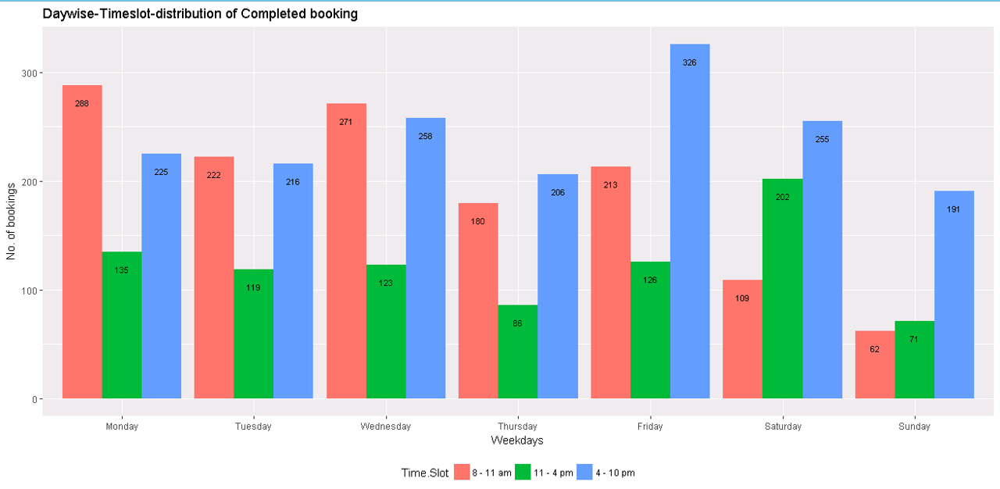
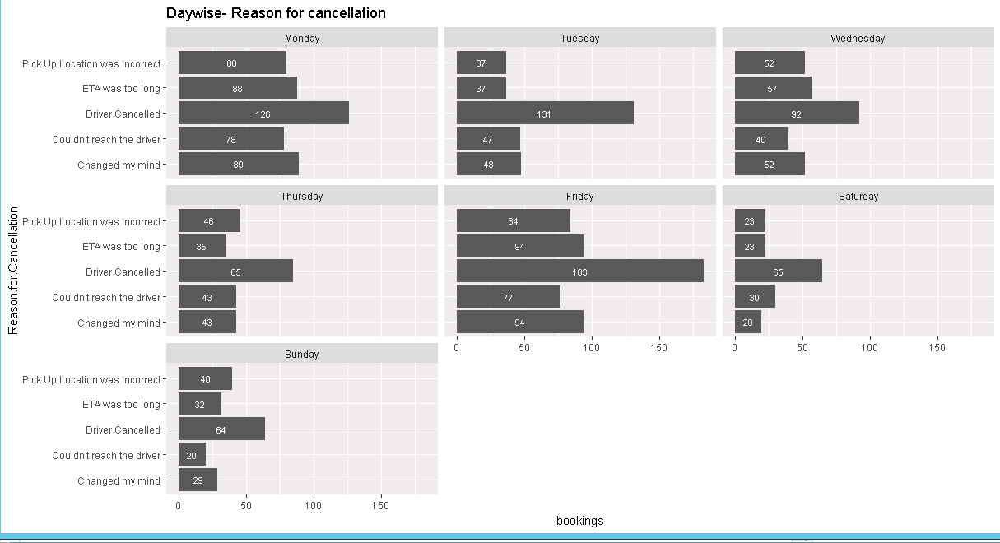
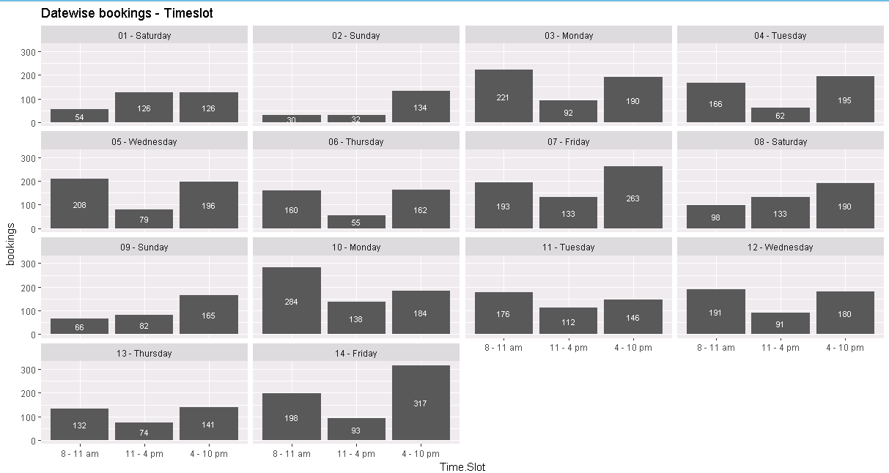
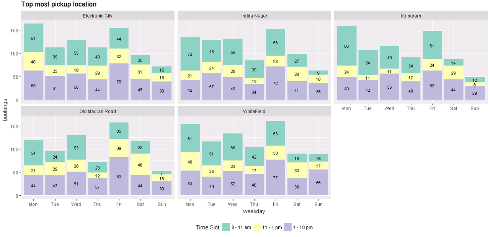
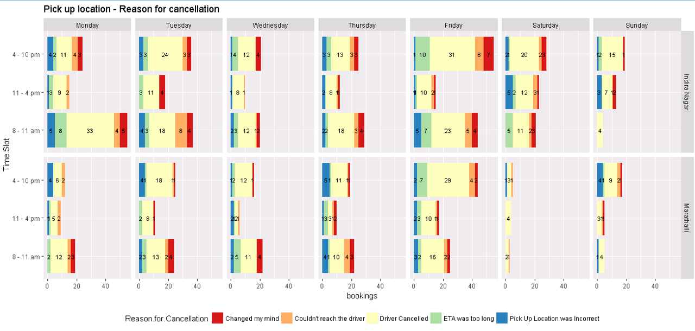

#### Setting working directory
```
setwd("C:\\Jig13242\\20 - Casestudy - Taximan")
library(ggplot2)
library(dplyr)
library(ggmap)
```
#### Importing raw data in R
```
rawdata<-read.csv("TAXIMAN_DATA.csv",header =TRUE ,stringsAsFactors = FALSE)
```
#### Understanding the data
```
summary(rawdata)
head(rawdata$Date)
```

#### Making copy of the rawdata
```
taxidata<-rawdata
```
#### Read date in date format
```
taxidata$date_new <- as.Date(taxidata$Date,"%m/%d/%Y")
```

#### Creating new variable - day of the weeks
```
taxidata$weekday <- weekdays(taxidata$date_new)
```
#### Removing extra space in the reponse
```
unique(taxidata$Coupon.Used)
taxidata$Coupon.Used <- sub("\\s+$","",taxidata$Coupon.Used)
unique(taxidata$Coupon.Used)
```

#### Creating new variable based Pickup and Drop location
```
taxidata$route <-paste(taxidata$Pick.Up.Location,"-",taxidata$Drop.Location)
```
#### Create a new variable on date and day.
```
taxidata$week_date <- format(as.Date(taxidata$date_new, format="%m/%d/%Y"),"%d")
taxidata$date_day <- paste(taxidata$week_date,"-",taxidata$weekday)
```
## Creating plot using ggplot to get insights into the data

#### Reordering the weekdays
```
taxidata$weekday<-as.factor(taxidata$weekday)
taxidata$weekday<-factor(taxidata$weekday,levels = c("Monday","Tuesday","Wednesday","Thursday","Friday","Saturday","Sunday"))
```

#### Reording the timeslots
```
taxidata$Time.Slot<-as.factor(taxidata$Time.Slot)
taxidata$Time.Slot<-factor(taxidata$Time.Slot,levels = c("4 - 10 pm","11 - 4 pm","8 - 11 am"))
```

#### Plot Daywise distribution of booking   


```
taxidata%>%group_by(weekday,Status)%>%arrange(weekday)%>%summarise(bookings=n())->weekdays_status
q1<-ggplot(data = weekdays_status,aes(x=weekday,y=bookings, fill =Status))
q1+geom_bar(stat = "identity")+ geom_text(aes(label=bookings),position = position_stack(vjust=0.5),size=3)+
  xlab("Weekdays")+ylab("No. of bookings")+labs(title="Daywise distribution of booking")
```
 

#### Daywise - timeslot of booking


```
taxidata%>%filter(Status=="Completed")%>%group_by(weekday,Time.Slot)%>%summarise(bookings=n())->weekday_timeslot_bookings
q01 <- ggplot(data= weekday_timeslot_bookings, aes(x=weekday,y=bookings, fill= Time.Slot))
q01+geom_bar(stat = "identity", position = "dodge")+ geom_text(aes(label=bookings),position= position_dodge(width =0.9),vjust =3,size=3)+
  xlab("Weekdays")+ylab("No. of bookings")+labs(title="Daywise-Timeslot-distribution of Completed booking")+
  theme(legend.position = "bottom")
```


#### Distribution of reason of cancellation



```
taxidata%>%filter(Status=="Cancelled")%>%group_by(weekday,Reason.for.Cancellation)%>%arrange(weekday)%>%summarise(bookings=n())->weekdays_cancel
q2<-ggplot(data=weekdays_cancel,aes(x=Reason.for.Cancellation,y=bookings))
q2+geom_bar(stat="identity") +coord_flip()+facet_wrap(~weekday)+ geom_text(aes(label=bookings),position = position_stack(vjust=0.5),size=3, colour ="white")+
 labs(title="Daywise- Reason for cancellation")
```

#### Disrtibution of Datewise bookings - Timeslot



```
taxidata%>%group_by(date_day,Time.Slot, Week)%>%arrange(Week,date_day)%>%summarise(bookings=n())->date_timeslot
q3<-ggplot(data = date_timeslot,aes(x=Time.Slot, y=bookings))
q3+geom_bar(stat="identity") +facet_wrap(~date_day)+
  geom_text(aes(label=bookings),color ="white" ,position = position_stack(vjust=0.5),size=3)+
  labs(title="Datewise bookings - Timeslot")
```

#### Distribution cancellation-weekdays


```
taxidata%>%filter(Status=="Cancelled")%>%group_by(weekday,Time.Slot,Reason.for.Cancellation)%>%arrange(weekday)%>%summarise(bookings=n())->cancell_timeslot_week

q4<-ggplot(data=cancell_timeslot_week,aes(x=Time.Slot,y=bookings,fill=Reason.for.Cancellation))
q4 + geom_bar(stat = "identity")+ geom_text(aes(label=bookings),position = position_stack(vjust=0.5),size=3)+
  facet_grid(weekday~., scales="free")+coord_flip()+  labs(title="Daywisebookings - Timeslot - Reason for cancellation")+
  theme(legend.position = "bottom")
 ```

#### Distribution of bookings and mode of payment


```
taxidata%>%filter(Status=="Completed")%>% group_by(weekday,Payment.Mode)%>%summarise(bookings=n())->weekday_payment

q6 <- ggplot(data=weekday_payment, aes(x=weekday,y=bookings, fill=Payment.Mode))
q6 + geom_bar(stat = "identity")+ geom_text(aes(label=bookings),position = position_stack(vjust=0.5),size=4)+
  theme(legend.position = "bottom")+labs(title = "Weekday booking and mode of payment")
```

#### Distribution of bookings and coupon usage


```
taxidata%>%group_by(weekday,Status,Payment.Mode,Coupon.Used)%>%summarise(bookings=n())->weekday_coupon
q7 <- ggplot(data=weekday_coupon, aes(x=Payment.Mode,y=bookings, fill=Coupon.Used))
q7 + geom_bar(stat = "identity")+ geom_text(aes(label=bookings),position = position_stack(vjust=0.5),size=4)+
  facet_grid(Status~weekday, scales = "free")+ scale_fill_brewer(palette = "Spectral")+#scale_fill_hue(c=40,l=80)+
  theme(legend.position = "bottom")+labs(title = "Weekday booking and coupon usage")
```


#### Distribution of coupon usage and timeslot


```
taxidata%>%filter(Status =="Completed")%>%group_by(weekday,Time.Slot,Coupon.Used)%>%summarise(bookings=n())->timeslot_coupon
q8 <- ggplot(data = timeslot_coupon, aes(x=Time.Slot, y=bookings, fill = Coupon.Used))
q8 + geom_bar(stat = "identity")+ geom_text(aes(label=bookings),position = position_stack(vjust=0.5),size=4)+
  facet_wrap(~weekday)+ scale_fill_brewer(palette = "Set3")+#scale_fill_hue(c=40,l=80)+
  theme(legend.position = "bottom")+labs(title = "Timeslot and coupon usage") 
```

#### Distribution based on pick up point


```
taxidata%>% group_by(Pick.Up.Location)%>%summarise(bookings=n())%>%arrange(desc(bookings))->pickuplocation
q10 <- ggplot(data = pickuplocation, aes(x=reorder(Pick.Up.Location, bookings),y=bookings))
q10 + geom_bar(stat = "identity")+ geom_text(aes(label=bookings),hjust = 2,vjust=0.5,size=3, colour = "white")+
    theme(legend.position = "bottom")+labs(title = "Top most pickup location") +coord_flip()+xlab("Pickup Location")
```


#### Distribution top 5 pickup points (Locationwise)


```
taxidata%>% filter(Pick.Up.Location%in% c("WhiteField","Electronic City","Indira Nagar","K.r.puram","Old Madras Road"))%>%
  group_by(weekday,Pick.Up.Location,Time.Slot)%>%summarise(bookings=n())->weekday_pickuplocation
q11 <- ggplot(data = weekday_pickuplocation, aes(x=weekday,y=bookings,fill = Time.Slot))
q11 + geom_bar(stat = "identity")+ geom_text(aes(label=bookings),position = position_stack(vjust=0.5),size=3)+
  facet_wrap(~ Pick.Up.Location, )+ scale_fill_brewer(palette = "Set3")+
  theme(legend.position = "bottom")+labs(title = "Top most pickup location") +
  scale_x_discrete(labels=c("Monday"="Mon","Tuesday"="Tue","Wednesday"="Wed","Thursday"="Thu","Friday"="Fri","Saturday"="Sat","Sunday"="Sun"))
```

#### Distribution of top 5 pickup location (daywise)


```
q12 <- ggplot(data = weekday_pickuplocation, aes(x=Pick.Up.Location,y=bookings,fill = Time.Slot))
q12 + geom_bar(stat = "identity")+ geom_text(aes(label=bookings),position = position_stack(vjust=0.5),size=3)+
  facet_grid(~ weekday )+ scale_fill_brewer(palette = "Set3")+
  theme(legend.position = "bottom")+labs(title = "Top most pickup location") + coord_flip()+
  scale_x_discrete(labels=c("Monday"="Mon","Tuesday"="Tue","Wednesday"="Wed","Thursday"="Thu","Friday"="Fri","Saturday"="Sat","Sunday"="Sun"))
 ```

#### Understanding booking status pickup location wise


```
taxidata%>%group_by(Pick.Up.Location,Status)%>%summarise(bookings=n())->pickup_cancel
q13 <- ggplot(data=pickup_cancel,aes(x=Pick.Up.Location,y = bookings, fill=Status))
q13 + geom_bar(stat = "identity")+ geom_text(aes(label=bookings),position = position_stack(vjust=0.5),size=3)+
   scale_fill_brewer(palette = "Set3")+
  theme(legend.position = "bottom")+labs(title = "Location - Booking Status")
```

#### Digging deeper to understand cancellations


```
taxidata%>% filter(Pick.Up.Location%in% c("WhiteField","Electronic City","Indira Nagar","K.r.puram","Old Madras Road","Marathalli")& Status =="Cancelled")%>%
  group_by(weekday,Pick.Up.Location,Reason.for.Cancellation)%>%summarise(bookings=n())->pickup_cance_reason
q14 <- ggplot(data = pickup_cance_reason, aes(x=Pick.Up.Location,y = bookings, fill= Reason.for.Cancellation))
q14+ geom_bar(stat = "identity")+ geom_text(aes(label=bookings),position = position_stack(vjust=0.5),size=3)+
  facet_grid(~ weekday)+ scale_fill_brewer(palette = "Set2")+
  theme(legend.position = "bottom")+labs(title = "Pick up location - Reason for cancellation")+coord_flip()
```


####  Cancellation issue in  Indira Nagar,Marathalli


```
taxidata%>% filter(Pick.Up.Location%in% c("Indira Nagar","Marathalli")& Status =="Cancelled")%>%
  group_by(weekday,Pick.Up.Location,Time.Slot,Reason.for.Cancellation)%>%summarise(bookings=n())->pickup_2loct_reason
q15 <- ggplot(data = pickup_2loct_reason, aes(x=Time.Slot,y = bookings, fill= Reason.for.Cancellation))
q15+ geom_bar(stat = "identity")+ geom_text(aes(label=bookings),position = position_stack(vjust=0.5),size=3)+
  facet_grid(Pick.Up.Location~ weekday)+ scale_fill_brewer(palette = "Spectral")+
  theme(legend.position = "bottom")+labs(title = "Pick up location - Reason for cancellation")+coord_flip() 
```


#### Top drop location


```
taxidata%>% group_by(Drop.Location)%>%summarise(bookings=n())%>%arrange(desc(bookings))->droplocation
q16 <- ggplot(data = droplocation, aes(x=reorder(Drop.Location, bookings),y=bookings))
q16 + geom_bar(stat = "identity")+ geom_text(aes(label=bookings),hjust = 2,vjust=0.5,size=3, colour = "white")+
  theme(legend.position = "bottom")+labs(title = "Top most drop location") +coord_flip()+xlab("Drop Location")
```

#### Drop location with time slot ( Completed)


```
taxidata%>% filter(Drop.Location%in% c("WhiteField","Electronic City","Indira Nagar","K.r.puram","Old Madras Road")& Status == "Completed")%>%
  group_by(weekday,Drop.Location,Time.Slot)%>%summarise(bookings=n())->drop_timeslot_compl
q18 <- ggplot(data = drop_timeslot_compl, aes(x=Drop.Location, y= bookings, fill = Time.Slot))
q18 + geom_bar(stat = "identity")+ geom_text(aes(label=bookings),position = position_stack(vjust=0.5),size=3, colour = "white")+
  facet_grid(~weekday)+ theme(legend.position = "bottom")+labs(title = "Top most drop locations - Completed")+coord_flip()
```

#### Creating a new variable of ride_status

```
taxidata$ride_status <- ifelse(taxidata$Status =="Completed","Completed",taxidata$Reason.for.Cancellation)
taxidata$ride_status <- as.factor(taxidata$ride_status)
taxidata$ride_status <- factor(taxidata$ride_status, levels = c("Driver Cancelled","Changed my mind","ETA was too long","Pick Up Location was Incorrect","Couldn't reach the driver","Completed"))
str(taxidata$ride_status)
```

#### Trying to understand demand and supply - drop pointbased


```
taxidata%>% filter(Drop.Location%in% c("WhiteField","Electronic City","Indira Nagar","K.r.puram","Old Madras Road"))%>%
  group_by(weekday,Drop.Location,ride_status)%>%summarise(bookings=n()->drop_ridestatus
q19 <- ggplot(data = drop_ridestatus, aes(x=Drop.Location, y= bookings, fill = ride_status))
q19 + geom_bar(stat = "identity")+ geom_text(aes(label=bookings),position = position_stack(vjust=0.5),size=3, colour = "white")+
  facet_wrap(~weekday,nrow=4)+ theme(legend.position = "bottom")+labs(title = "Top most drop locations - Status")+coord_flip()
  ```

#### Trying to understand demand and supply - pickup based


```
taxidata%>% filter(Pick.Up.Location%in% c("WhiteField","Electronic City","Indira Nagar","K.r.puram","Old Madras Road","Marathalli"))%>%group_by(weekday,Pick.Up.Location,ride_status)%>%summarise(bookings=n())->pickup_ridestatus
q20 <- ggplot(data = pickup_ridestatus, aes(x=Pick.Up.Location, y= bookings, fill = ride_status))
q20 + geom_bar(stat = "identity")+ geom_text(aes(label=bookings),position = position_stack(vjust=0.5),size=3, colour = "white")+
 facet_wrap(~weekday,nrow=4)+ theme(legend.position = "bottom")+labs(title = "Top most pick locations - Ride Status")+
  coord_flip()+scale_fill_brewer(palette = "Spectral")
```

#### Route based distribution


```
taxidata%>%group_by(route)%>%summarise(bookings=n())%>%arrange(desc(bookings))%>%filter(bookings>80)->route_bookings
q21 <-ggplot(data=route_bookings,aes(x=reorder(route, bookings),y=bookings))
q21 + geom_bar(stat = "identity", width = 0.7,)+ geom_text(aes(label=bookings),size=3,hjust= 1.2,vjust=0.3, colour = "white")+
 labs(title = "Top most routes")+ scale_colour_gradient2(low ="blue", high= "Red")+
  theme(legend.position = "bottom", axis.text.y =element_text(size = 8))+ ylab("No of bookings")+xlab("Route")+coord_flip()
  scale_x_discrete(labels=c("Monday"="Mon","Tuesday"="Tue","Wednesday"="Wed","Thursday"="Thu","Friday"="Fri","Saturday"="Sat","Sunday"="Sun"))
```  


#### Importing bangalore map

```
bangalore_map <- get_map(location = c(lon=mean(lon),lat=mean(lat)), zoom = 12,maptype = "roadmap",source = "google")
```

#### Plot pickup points on map


```
ggmap(bangalore_map) +geom_point(data = taximan_pick, aes(x = Longitute, y = Latitude, alpha = 0.4, size = Pickup, color = Pickup)) +
  guides(fill=FALSE, alpha=FALSE, size=FALSE)+ scale_size_continuous(range = c(1,12))+ scale_color_continuous(high = "Yellow", low = "Blue")+
  geom_text(data = taximan_pick, aes(x = Longitute, y = Latitude,label=Pickup), vjust = 1.8)+labs(title="Pickup Location in Bangalore")
```

### Plotting drop location on map


```
ggmap(bangalore_map) +geom_point(data = taximan_drop, aes(x = Longitute, y = Latitude, alpha = 0.4, size = Drop, color = Drop)) +
  guides(fill=FALSE, alpha=FALSE, size=FALSE)+ scale_size_continuous(range = c(1,12))+ scale_color_continuous(high = "Yellow", low = "Blue")+
  geom_text(data = taximan_drop, aes(x = Longitute, y = Latitude,label=Drop), vjust = 1.8)+labs(title="Drop Location in Bangalore")
```
                                        
   
